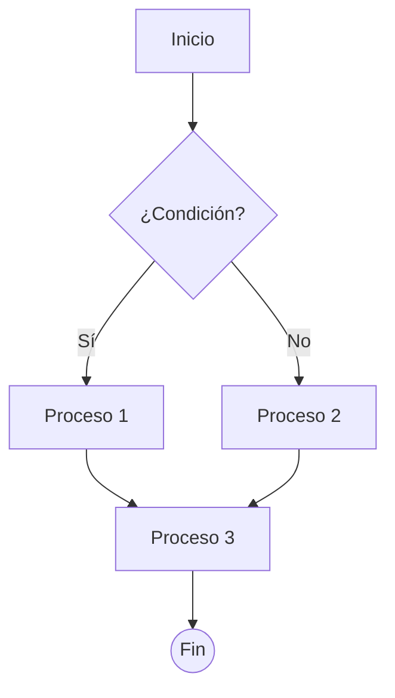

+++
title = 'Mermaid: transforma tus ideas en un diagrama claro y mejora la definición de tu producto'
date = 2025-03-17T06:05:00-03:00
draft = false
tags = ["mermaid", "alineación", "visibilidad", "documentación"]
categories = ["herramientas"]
description = 'Una herramienta que facilita la definición de productos, servicios, flujos y procesos.'
+++

> _TL;DR: Con IA y Mermaid puedes transformar descripciones de texto en diagramas visuales de procesos y flujos. Mermaid es un lenguaje de diagramas que permite representar procesos y flujos de manera visual._

Si queremos generar compresión compartida y evitar confusiones necesitamos herramientas que faciliten comunicar y visualizar nuestras ideas. Algo que funciona tanto al trabajar en equipo como al hacerlo con LLMs.



Hace varias semanas comencé a hacer _[vibe coding](https://en.wikipedia.org/wiki/Vibe_coding)_, y rapidamente me vi en la necesidad de aumentar el contexto que le entrego a los diferentes modelos de IA con los que trabajo, así como a Cursor y Windsurf. Por eso comencé a usar activamente Mermaid como una manera de visualizar estructuras y flujos. Algo que me parece indispensable cuando estás construyendo un producto o servicio.

**Prueba esto**: describe tu proyecto a tu IA favorita y pídele que genere un diagrama en Mermaid. Cuanto más detallada sea tu descripción, más precisa será la representación.

En mi caso, prefiero usar Claude 3.7 Sonnet para esto. Seguro llegarás a versiones bastante más complejas, pero en la base conseguirás una estructura como esta:



Con esto podrás representar procesos simples o complejos, de una o varias rutas, podrás agregar colores que faciliten su visualización y mucho más.



Esto te permitirá visualizar, iterar y ampliar tu visión –simplemente a través de chat:

1. Solicita la estructura inicial.
2. Visualiza el diagrama con una herramienta.
3. Ajusta, añade o elimina pasos y elementos.

Para visualizar el diagrama, usa herramientas online gratuitas como Mermaid Live Editor o Excalidraw, o implementa el código directamente en un html directo en tu computador:

```html
<!DOCTYPE html>
<html>
<head>
 <meta charset="UTF-8">
 <title>Diagrama Mermaid</title>
 <script type="module">
 import mermaid from 'https://cdn.jsdelivr.net/npm/mermaid@10/dist/mermaid.esm.min.mjs';
 mermaid.initialize({ startOnLoad: true });
 </script>
</head>
<body>
 <div class="mermaid">
 [INSERTAR MERMAID AQUÍ 👋]
 </div>
</body>
</html>
```

A fin de cuentas, Mermaid es un herramienta de comunicación, que permite quitar ambiguedad. Te permite desarrollar y transmitir ideas complejas y alinear a todas las partes involucradas, incluyendo a asistentes de IA –que ya sabemos rinden mejor cuando tienen un contexto claro– y puedes usar la propia IA para generar y mejorar estos diagramas.